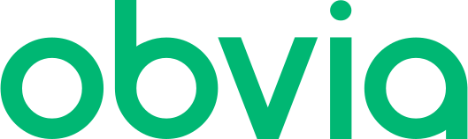

  <picture>
    <source media="(prefers-color-scheme: dark)" srcset="../assets/svg/wordmark-dark.svg">
    <source media="(prefers-color-scheme: light)" srcset="../assets/svg/wordmark.svg">
    
  </picture>

## About

**Obvia** is a comprehensive library of helpful tools for developers with a powerful, lightweight and dynamic structure that streamlines
your creation and editing process in your application development process. Makes your application development experience most enjoyable 
by officially offering you ready-made user interface components for many JavaScript frameworks and web-based application development 
frameworks.

### Ecosystem
- [**Obvia**](https://obvia.studio) – We’ve already laid the foundation for your next big idea — freeing you to build faster and smarter **(Soon)**
- [**Studio**](https://app.obvia.studio/) – Collaborative space to design, prototype, and manage projects with Obvia tools **(Soon)**
- [**Console**](https://obvia.studio/console) – A CLI tool providing a streamlined setup and development experience across frameworks **(Soon)**
- [**Interface**](https://obvia.studio/interface) – A design system and UI kit with ready‑to‑use templates for dashboards, websites, and applications **(Soon)**
- [**Blocks**](https://obvia.studio/blocks) – Modular layout structures for dashboards, websites, and applications **(Soon)**
- [**Templates**](https://obvia.studio/blocks) – Premium website and app templates for rapid deployment **(Soon)**
- [**Icons**](https://obvia.studio/icons) – Exclusive icon sets crafted for modern apps and consistent design language **(Soon)**

### Icons  
A newly designed icon family crafted for designers, developers, and storytellers who demand clarity and impact **(Soon)**

- [**Obvia Solid**](https://github.com/obvialabs/icons) – A geometric, filled icon family built for strength and clarity.
With bold silhouettes and uncompromising presence, it anchors buttons, navigation, and high‑impact interfaces where 
decisiveness matters.

- [**Obvia Outline**](https://github.com/obvialabs/icons) – A refined, line‑based companion that celebrates precision and 
restraint. Its airy strokes bring elegance to dashboards, minimalistic systems, and modern UI frameworks, balancing clarity 
with sophistication.

- [**Obvia Duotone**](https://github.com/obvialabs/icons) – A layered, expressive family that plays with contrast and depth. 
By weaving two tones into each form, it transforms icons into storytellers — perfect for branding, creative apps, and 
interfaces that demand personality.

### Typeface
A newly designed font family crafted for designers, developers, and storytellers who demand clarity and impact

- [**Obvia Sans**](https://github.com/obvialabs/fonts/tree/main/fonts/Obvia) - A geometric sans-serif crafted for precision
and readability. Rooted in Swiss modernist principles, it balances simplicity with strength, making it suitable for body text,
headlines, branding, and large-scale display use.

- [**Obvia Mono**](https://github.com/obvialabs/fonts/tree/main/fonts/ObviaMono) – A monospaced companion to Obvia Sans. Designed
for technical contexts — code editors, diagrams, and terminal interfaces — it brings consistency and clarity to environments where
structure matters most.

- [**Obvia Pixel**](https://github.com/obvialabs/fonts/tree/main/fonts/ObviaPixel) – A playful display family of five pixel-inspired
styles. Each variant explores a different facet of digital aesthetics, offering bold, decorative forms for logos, posters, and expressive
headlines.
